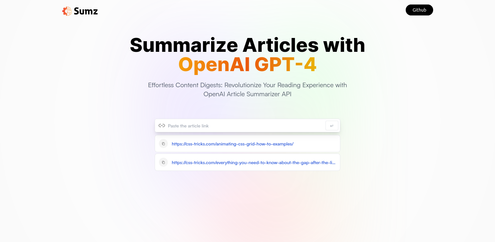

# Article Summarizer Website

A web application that extracts and summarizes articles using the Article Extractor and Summarizer APIs. Users can also explore recent articles.

## Table of Contents

- [Introduction](#introduction)
- [Features](#features)
- [Technologies Used](#technologies-used)
- [Usage](#usage)
- [API](#apis) 

## Introduction

[Article Summarizer Website](https://ai-summarizer-9e13c.web.app/) is a React-based web application that leverages the Article Extractor and Summarizer API to extract content from articles and provide concise summaries. Additionally, users can access a list of recent articles for their reading pleasure.

To checkout the website [click here.](https://ai-summarizer-9e13c.web.app/)

## Features

- Article Extraction: Extract content from articles by providing a URL.
- Summarization: Generate summaries for extracted articles.
- Recent Articles: Display a list of recent articles for users to explore.
- Responsive Design: The website is designed to work on various screen sizes.

## Technologies Used

- [React](https://reactjs.org/): A JavaScript library for building user interfaces.
- [Tailwind CSS](https://tailwindcss.com/): A utility-first CSS framework.
- [Axios](https://axios-http.com/): A promise-based HTTP client for making API requests.
- [Article Extractor and Summarizer API](https://example.com/article-extractor-api): API for extracting content from articles and generating article summaries.

## Usage

- Open the website in your web browser.

- To extract and summarize an article:Enter the URL of the article you want to summarize. Click the "↵" button.
- View the summarized content.

- To view recent articles, click the links of recent articles.

## API

### This project uses the following API:

- [Article Extractor and Summarizer API](https://rapidapi.com/restyler/api/article-extractor-and-summarizer): The API is used to fetch and extract content from articles/news based on their URLs and uses GPT to generate concise summaries of articles/news.